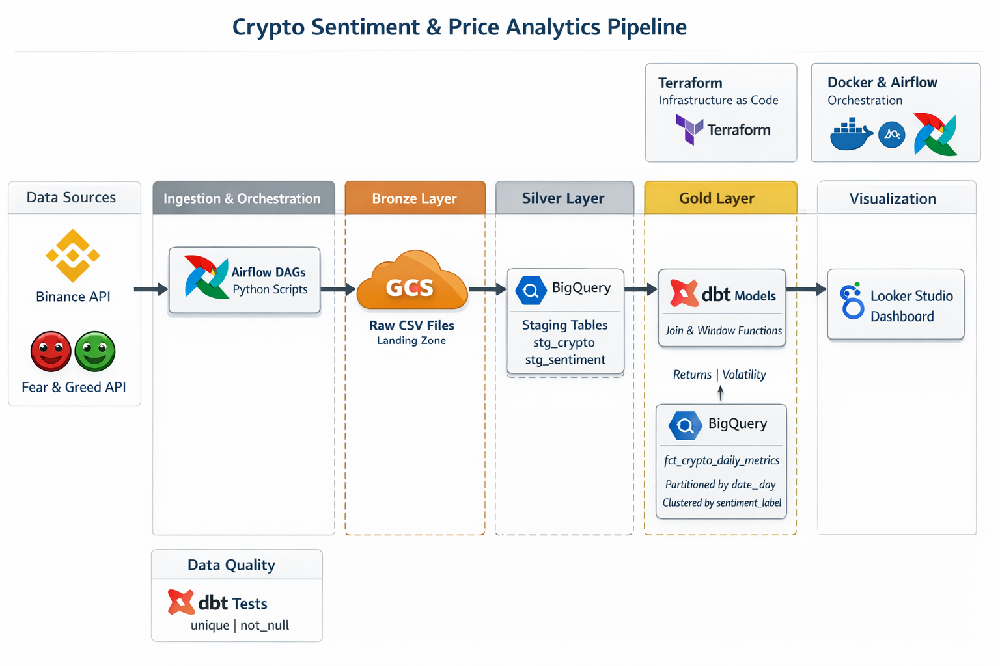
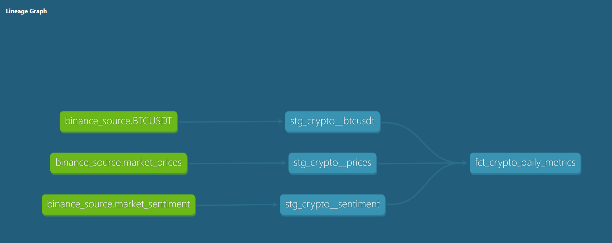
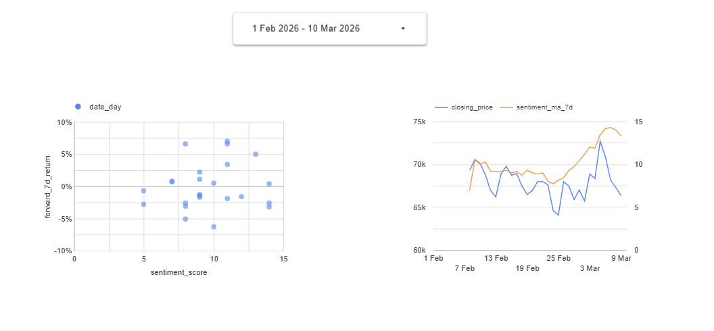

## Crypto Sentiment & Price Analytics Pipeline
### 1. Project Overview
This project addresses the challenge of quantifying market psychology in the highly volatile cryptocurrency sector.

* **The Problem**: Investors often struggle to determine if the "Fear & Greed Index" is a lagging indicator or a valid predictive signal for short-term price reversals.

* **The Solution**: An end-to-end data pipeline that integrates Binance transaction data with market sentiment indices. By modeling this data, the project identifies "Fear-driven" bottoms and validates the "Buy the Fear" strategy through historical backtesting.

---

### 2. Tech Stack
* **Cloud Platform**: Google Cloud Platform (GCP)

* **Infrastructure as Code**: Terraform (Used to provision GCS Buckets and BigQuery Datasets)

* **Orchestration**: Apache Airflow (Workflow management)

* **Processing Engine**: Apache Spark (PySpark for data cleaning and Parquet conversion)

* **Data Lake**: Google Cloud Storage (GCS)

* **Data Warehouse**: BigQuery (Partitioned and Clustered)

* **Transformation**: dbt (Data Build Tool)

* **Visualization**: Looker Studio

---

### 3. Data Pipeline Architecture


The pipeline follows a **Medallion-style architecture**:

* **Ingestion**: A containerized **PySpark** job fetches Binance Ticker data and Fear & Greed API data.

* **Landing**: Raw CSVs are uploaded to **GCS (Google Cloud Storage)** as the landing zone.

* **Staging**: Data is loaded into **BigQuery** using External or Native tables to prepare for transformation.

* **Production**: **dbt** transforms raw data into a `fct_crypto_daily_metrics` table, applying window functions for volatility and returns.

**Data Lineage (dbt)**

Below is the visualization of the data flow, showing how the three distinct sources converge into our final metrics table:

#### This graph illustrates the transformation from `stg_` models to the final 

---

### 4. Reproducibility & Setup
This project uses a Makefile to encapsulate complex commands, ensuring consistent execution across different environments.

**Prerequisites**
* **Google Cloud Account**: A project with Billing and BigQuery/GCS APIs enabled.
* **GCP Credentials**: A Service Account JSON key stored locally (referenced in `profiles.yml`).
* **Docker & Docker-compose**: For the Airflow orchestration layer.
* **Terraform**: For infrastructure as code.

**🚀Quick Start (Automated Environment Setup)**

The following command provisions the cloud resources and starts the Airflow environment:

```bash
make setup
```
*This handles Infrastructure (Terraform) and Orchestration (Docker/Airflow) in one go.*

**🔧Step-by-Step Manual Execution**

If you prefer to run components individually:

**Step 1: Infrastructure (IaC)**

Provision the required GCS buckets and BigQuery datasets:

```bash
make infra-up
```

**Step 2: Orchestration (Airflow)**

* **Spin up the environment**: Start the Airflow containers.
  ```bash
  make docker-up
  ```

* **Access the UI**: Go to localhost:8080 (Default: airflow/airflow).

* **Configure Connection**: Ensure the google_cloud_default connection is configured with your GCP Project ID and Service Account JSON key.

* **Manual Pipeline Execution**:

  - Unpause & Trigger binance_spark_ingestion_v1: This fetches the core market data (Source of Truth).

  - Unpause market_metadata_ingestion_v1: This DAG is downstream. It uses an ExternalTaskSensor to wait for the Binance ingestion to succeed before processing sentiment indices.

Note: This decoupled design ensures strict Data Lineage and prevents the sentiment analysis from running on missing or stale price data.

**Step 3: Transformation (dbt)**

Once raw data is available in BigQuery, run the dbt models to transform landing data into production-ready metrics:

```bash
make dbt-run
```
*Note: This command executes dbt deps and dbt run within the Airflow container to ensure proper permissions and dependencies.*

**Data Quality & Maintenance**

To ensure the pipeline remains healthy, use the built-in linting and cleaning tools:

* make clean: Removes Docker volumes and temporary dbt artifacts.

* make dbt-test: Runs only the data integrity tests (unique, not_null, relationship).

---

### 5. Data Warehouse Optimization
The `fct_crypto_daily_metrics` table in BigQuery is optimized using a combined **Partitioning** and Clustering **strategy**:

#### Partitioning by `date_day`
* **Strategy**: `partition_by = {"field": "date_day", "data_type": "date", "granularity": "day"}`

* **Reasoning**: Crypto market data is inherently time-series. Most analytical queries filter by a specific date range.

* **Benefit**: BigQuery only scans the relevant daily blocks instead of the entire dataset, significantly reducing query costs and improves response time.

#### Clustering by `sentiment_label`
* **Strategy**: `cluster_by = ["sentiment_label"]`

* **Reasoning**: A primary use case is to compare performance across different sentiment categories (e.g., "Extreme Fear" vs. "Greed").

* **Benefit**: Clustering organizes the data physically, making filter operations like `WHERE sentiment_label = 'Extreme Fear'` much more efficient.

---

### 6. Dashboard & Insights
The final analysis is presented in a Looker Studio Dashboard featuring 2 core tiles:

* **Tile 1**: Fear-Return Scatter Plot: Shows the correlation between low sentiment scores and positive 7-day forward returns.

* **Tile 2**: Trend Divergence Chart: A dual-axis time series comparing BTC Price vs. 7-day Moving Average Sentiment.



**Project Observations & Future Roadmap**

As the current ingestion pipeline is in its initial phase, the following observations and planned enhancements have been identified:

* **Current Status (Proof of Concept)**: The pipeline successfully demonstrates the end-to-end integration of Binance trade data, CoinGecko prices, and Alternative.me sentiment indices.

* **Data Limitation**: Due to the limited 30-day window and API rate limits during the initial run, current visualizations serve as a functional demonstration rather than a statistically significant backtest.

* **Future Roadmap:**

  - **Historical Backfilling**: Implement a dedicated Spark job to backfill 2+ years of historical trade data to validate the "Buy the Fear" hypothesis at scale.

  - **Advanced Modeling**: Transition from simple moving averages to real-time anomaly detection for price volatility vs. sentiment shifts.

  - **Expanded Scope**: Ingest data for additional assets (ETH, SOL) to compare sentiment sensitivity across different market caps.

---

### 7. Data Quality & Testing
* **dbt Tests**: Basic data integrity is ensured using dbt tests defined in `schema.yml`. 
  - `unique` and `not_null` tests are applied to the `date_day` primary key.
* **Validation**: Running `dbt test` before updating production tables prevents duplicate records or missing data from affecting the final dashboard.

* **Error Handling & Resilience**:
    - **Retry Logic**: All Airflow tasks are configured with `retries: 2` and a `retry_delay` of 5 minutes to handle transient network issues during API calls.
    - **Alerting Framework**: The DAGs include `on_failure_callback` hooks. While the production Slack/Email API keys are excluded for security, the logic is pre-integrated for easy enterprise deployment.
---
